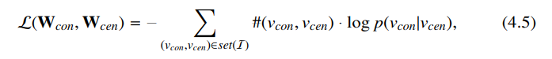

## Chapter4 Graph Embedding
### 2022.03.17

### 4.1 Introduction

Graph Embedding尝试通过映射函数Mapping Function将一个给定图$\mathcal{G}=\{\mathcal{V},\mathcal{E}\}$中的结点映射到更低维度的空间中。例如可以将给定图中的某一结点映射成一个$d$维的向量，即$f:\mathcal{V}\mapsto R^{N\times d}$，其中$N=|\mathcal{V}|$，而$d$为单个结点通过映射函数映射到低维空间中的向量。**在将图像中的结点映射到低维空间的同时需要在低维空间中也保留有原图中的信息**，要保存什么信息，如何保存这种信息，这便引出了Graph Embedding中最重要的两个问题

在Graph Embedding中最重要的两个问题即是：
1. 要保存什么信息(what infomation to preserve?)
2. 如何保存该信息(how to preserve?)

大致的Graph Embedding框架中有四个重要的组成部分：
* Mapping Function：映射函数将图中的结点映射到Embedding Domain
* Information Extractor：从原图中提取出想要保存到Embedding Domain中的重要信息
* Reconstructor：从映射后的域Embedding Domain中提取出信息，保证原图中的信息没有被破坏（通过Objective Function判断/保存）
* Objective Function：通过Objective Function来学习参数

### 4.2 Graph Embedding on Simple Graph

### 4.2.1 Preserving Node Co-occurrence

Node Co-occurrence即为结点与结点之间的链接关系，若在Graph Domain中结点$v_i,v_j$是相邻接的话，则在映射之后的Embedding Domain中，我们希望两节点映射后得到的向量之间的距离（distance）也是相近的。

**Mapping Function**：最直接的映射函数即使查找表(look-up table)，通过one-hot编码来为每一个图中的结点显式的指定映射后的低维向量。参数即直接是图中各结点映射后的低维向量。$f(v_i)=u_i=e^T_iW$，其中$e^T_i$是查找表的指示函数（one-hot编码形式），当对应的是图中结点$v_i$的时候，$e_i$中除了第i个元素element为1，其余都为零。即通过Mapping Function可以直接获得图中结点对应的低维向量，如此一来，仅需将$W$中变量设定为参数，既可以通过learning的方法来获得图中结点到低维空间的映射。

**Random Walk**：即对于图中一个给定的结点$v^{(0)}$而言，我们可以随机访问该节点的一个相邻结点。重复访问某结点的相邻结点，直到已经访问了T个结点时停止，这就是一个长度为T的random walk。

标准定义：对于给定connected graph，一个从$v^{(0)}$开始的random walk访问下一结点的概率是$p(v^{(t+1)}|v^{t})=1/d(v^{t}), if\quad v^{(t+1)}\in \mathcal{N}(v^{(t)}), 0 \quad else$。即random walk随机性地访问$v^t$的所有相邻结点，对于$v^t$的所有邻接结点而言，下一次访问的概率都是相同的。即$\mathcal{W}=RW(\mathcal{G},v^{(0)},T)$生成在给定图中，从给定结点开始生成长度为T的random walk。

为了捕获全局的信息，一般对图中每一个结点进行$\gamma$次random walk，即一个给定图的总random walk数为$\gamma\cdot N$。故若两结点之间有邻接关系，这两个结点的tuple$(v^t,v^{t+1})$出现在random walk中的次数也就越多。

这里考虑图中的结点一般会扮演两种角色role: center or context nodes。按照如此定义，我们在每一个条random walk路径中定义$(v_{con},v_{cen})$ tuple，将图中的每一个结点定义为$v_{cen}$并将其余结点设为$v_{con}$，并依次将所有tuple放进从图中提取出来的信息数组中$\mathcal{I}$中。 

**Reconstructor and Objective**：Reconstructor通过重构Mapping Function映射后的低维向量来重构结点之间的邻接关系，所以，我们通常是希望Reconstructor重构后的信息与原图中所提取出来的信息关联性越大越好。于是，这里根据一个结点可能在图中扮演的角色，center/context node，分别设置两个映射函数：$f_{cen}=u_i=e_i^TW_{cen},\quad f_{con}=v_i=e_i^TW_{con}$，所以对从原图random walk所提取出来的队列$\mathcal{I}$中的任意tuple$(v_{con},v_{cen})$，其概率$p(v_{con}|v_{cen})$应当较大，故有从序列$\mathcal{I}$中所提取出来的tuple概率乘积应当最大，这应当是最终的优化目标：

**Hierarchial Softmax**：由于在上式4.2中，实际计算概率时直接计算该分式的分母时computational unfeasible的，于是可以采用hierarchical softmax的方法来加速计算。本质上这种softmax下的分母计算过于庞大，而hierarchical softmax可以依次计算，降低了时间复杂度。

**Negative Sampling**：与推荐系统中的负采样相同，因为从原图所提取出来的信息中仅包含了正样本（即仅有两结点确有邻接关系的结点对，而没有实际上没有邻接关系的结点对），使用负采样随机的抽选没有邻接关系的结点对加入到所提取队列中，便可以提高模型的performance。

**Other co-occurrence preserving methods**：
1. node2vec：即在原来Deepwalk的基础上更改了random walk的采样逻辑，在node2vec中增加了采样路径往回采样或是停在原地的可能性。实际上就是，原random walk是深度优先搜索，而node2vec结合了广度优先搜索和深度优先搜索。

**Matrix Factorization View**：整个Embedding Method可以从矩阵分解的角度来看待。

### 4.2.2 Perserving Structural Role
不同于Co-occurrence Features, Structural Roles of nodes in Graph也同样重要，例如如下图中，我们更希望结点$u,v$在低维空间之中的距离更近，如此一来便可以保存图中结点的结构信息。

直觉上来说，描述两节点直接得结构信息使用结点的度degree信息，因此定义两结点在考虑离结点距离为k的邻接结点的距离为$g_k(v_1,v_2)=g_{k-1}(v_1,v_2)+dis(s(R_k(v_1))+s(R_k(v_2)))$，其中$R_k(v_1)$为距离结点$v_1$距离为k的邻接结点集合，$s(R_k(v_1))$即为该集合中的点的度按升/降序排列之后的结构。

如此一来便可以构建一个k层的图，每一层图表示距离某一距离的structural information，每个层之间的相同结点相连接。点与点之间的权重$w_k(u,v)=exp(-g_k(u,v))$，如此一来，两点之间的距离越短，在图中的链接越强。接下来就可以使用random walk来提取原图中的structral information，并还是使用两个映射函数$f_{cen}=u_i=e_i^TW_{cen},\quad f_{con}=v_i=e_i^TW_{con}$，最大化概率来求解。

**其实本质就是：在提取co-occurrence信息的过程中，原图就可以表示图中结点之间的链接关系，故可以之间使用random walk来从原图中提取信息。但是想要提取structural information的话，需要额外构造一张新的图，图中结点的邻接关系表示着两节点之间的结构角色是否相似，如此一来，新构造图结点之间的关系（结构关系）就和原图中结点之间的关系（邻接关系）一致，这样就可以使用和提取co-occurrence信息相同的方法来处理结构信息。**

### 4.2.3 Preserving Node Status

该节侧重于保护结点本身的信息，但是一般不会直接去保存结点本身的信息，而是通过保存结点特征的排名（即各结点之间特征排名来间接保存结点信息/preserving global node status ranking）

**Extractor**：提取器首先提取各结点的global status score（比如centrality之类的信息），在获取过各个结点的信息后，将各结点依据提取的信息进行排序得$(v_{(1)},v_{(2)},...,v_{(N)})$。

假设各结点对之间的排列顺序与序列中的其他结点对无关，则有$p_{global}=\prod_{1\leq i<j \leq N}p(v_{(i)},v_{(j)})$，其中$p(v_{(i)},v_{(j)})=\sigma(w^T(u_{(i)}-u_{(j)}))$。整个过程的objective就是使经过mapping函数映射后的低维向量之间的差值经过参数乘积以及激励函数后有最大值。

### 4.2.4 Preserving Community Structure

Community Structure信息包含各结点之间的连接关系，对于一个图的邻接矩阵$A$而言，两结点之间邻接关系的相似程度可以用如下表达式表示出来$s_{i,j}=\frac{A_iA_j^T}{||A_i||\cdot||A_j||}$，如此一来可以将邻接关系与两结点之间的邻接关系相似程度用$P=A+\eta\cdot S$来表示，即可以使用如下objective并使用如同deepwalk一样的方法来优化：$\mathcal{L}(W_{con},W_{cen})=||P-W_{con}W_{cen}^T||$

Community Structure则是通过最大化modularity来完成的

因此，结合以上，Preserving Community Structure的总objective为：

### 4.3 Graph Embedding on Complex Graph

### 4.3.1 Heterogeneous Graph Embedding

异构图为图中不同的结点/路径都赋予了不同的类型，即图中的结点/路径的类型可能是不同的，如此一来，我们便需要针对不同类型的结点/路径设计不同的映射函数（mapping function）。HNE方法即是如此，为不同的类型的结点或是路径单独分配不同的映射函数。图中最重要的信息即为各结点之间的邻接信息，即为图的邻接矩阵$A$，故**若仅想恢复/保存图中的邻接信息co-occurrence information**的话，仅需使用映射后的低维空间向量，建模当邻接矩阵中某两结点邻接情况的矩阵（即建模邻接矩阵），$p(\tilde{A}_{i,j}=1)=\sigma(u_i^Tu_j)$，使用交叉熵objective function来优化，即可以学习映射函数中的参数$-\sum_{i.j=1}^T(A_{i,j}\log p(\tilde{A}_{i,j}=1)+(1-A_{i,j})\log p(\tilde{A}_{i,j}=0))$，$\tilde{A}$为重建后的邻接矩阵。

当时在异构图中有时候我们希望在保留结构信息的同时，也保留语义之间的关联(semantic correlations，即考虑到不同类型的结点和路径)。

由此，定义meta-path schema为一条给定的路线模式$A_1\stackrel{R_1}{\longrightarrow}A_2\stackrel{R_2}{\longrightarrow}...\stackrel{R_l}{\longrightarrow}A_{l+1}$。对于当前的结点根据meta-path schema选择下一个类型的结点，即通过给定二第meta-path schema使用random walk生成给定的meta-path random walk路线，后续即和Deepwalk一致。

### 4.3.2 Bipartite Graph Embedding

在一个二分图中，一般想要提取的信息是

1. 两个不相交的结点集合之间的边连接信息
2. 在一个结点集合中的结点的邻接信息(co-occurrence information within each node set)

对于第一个信息，即两个结点集之间的连接关系，一般对两结点是否连接的概率进行建模$p(u_i,u_j)=\sigma(u_i^Tv_j)$，即通过如下的优化函数优化映射函数中的参数$\mathcal{L}=-\sum_{(u_i,v_j)\in\mathcal{E}}\log p(u_i,v_j)$。

对于第二个信息，则可以通过将两个独立的结点集构造成两个独立的图，在新构造的图中，某一结点集中相距2个单位的结点在新构造的图中视为邻接（相当于是在二分图中在一结点集中的两结点同时连接到另一结点集的同一结点）。于是对于两个新构造的图而言，对其分别做random walk随后使用如deep walk一样的方法来计算参数。

综合上述两个信息可得总优化函数$\mathcal{L}=\mathcal{L}_\mathcal{E}+\eta_1\mathcal{L}_\mathcal{U}+\eta_2\mathcal{L}_\mathcal{V}$

### 4.3.3 Multi-dimensional Graph Embedding

对于多维图来说，想要提取的信息一般是：

1. general node representation，即一个结点在多维图中的总的表示，一般在node classification等任务中更有用
2. specific dimension representation for node，即一个结点在不同的维度（多维图中的维度，多维图的结点有多个维度的邻接关系，即在每个维度图的邻接矩阵不一致）中结点的特殊表示，可以用来做link prediction等任务

故对于一个维度$d$的结点$i$有$u_{d,i}=u_i+r_{d,i}$，其中$r_{d,i}$是结点$i$在维度$d$上不考虑依赖关系（general node representation信息与specific dimension的信息一般是相关的）提取出来的信息。故对上式中的两项分别建模有$u_i=e^T_iW$，$r_{d,i}=e^t_iW_d$。为了提取信息有对于每一个维度采用Random Walk方法提取序列，有$\mathcal{I}=\cup_{d=1}^D\mathcal{I}^d$。故总的objective function即为考虑了每一维度的random walk序列的优化函数。

### 4.3.4 Signed Graph Embedding

对于有符号图来说，我们认为有正号之间的结点的关系要比负号之间结点的关系更加紧密。故对于一个有符号图来说，一个triplet意思是$\mathcal{I}_1=\{(v_i,v_j,v_k)|A_{i,j}=1,A_{i,k}=-1, v_i,v_j,v_k\in\mathcal{V}\}$集合中$(v_i,v_j)$之间是正符号，而$(v_j,v_k)$之间是负符号。对于triplet中同时有正边和负边的时候，就可以之间判断，但是若一个triplet中仅有正边或是负边一般就无法判断，这时可以通过多增加一个虚拟点，并与原来的点用负边相连，这是就可以强调正边的相近性。一般认为构造负符号要比构造正符号消耗(cost)大，如此一来，对于一个相同符号的triplet而言，可以增加一个虚拟点，将原triplet划分成两个单独的异符号的triplet，随后使用某些判断函数对其进行评价是正边所得score比**由负边构造的正边**所得score大，将一个triplet划分成两个的示意图如下：

所得objective function如下：

### 4.3.5 Hypergraph Embedding

Hypergraph与一般图形式不同，其hyperedge更像是一个区域，一个区域中有多个结点，这样可以称之为该hyperedge与这些结点相连接，hypergraph示意图如下所示，图中author1/2/3相当于是不同的hyperedge：

对于hyper graph而言一般用incidence matrix$H$来描述每个结点与各hyperedge的从属关系，故对于hypergraph的co-occurrence信息可以通过如下矩阵描述$A=HH^T-D_v$，对于$A$中的元素表示$v_i,v_j$同时出现在一个hyperedge的次数。于是想要描述Hyperedge的global o-occurrence信息就可以使用mapping function来拟合矩阵$A$，映射函数$u_i=f(A_i;\Theta)$，拟合矩阵$\tilde{A}_i=f_{re}(u_i;\Theta_{re})$。

除此之外，一般还希望能够恢复hyperedge information,一个hyperedge存在于一个给定集合结点的概率定义为$p(1|\mathcal{V}^i)=\sigma(g([u^i_{(1)},...,u^i_{(k)}]))$，其中$\mathcal{V}^i=\{v^i_{(1)},v^i_{(2)},...,v^i_{(k)}\}$，其中$g$是一个前向传播网络。最终优化函数为（交叉熵）：

结合起来为$\mathcal{L}=\mathcal{L}_1+\eta\mathcal{L}_2$

### 4.3.6 Dynamic Embedding

因为加入了时间戳故引入时序random walk：

其中：

Dynamic Embedding因为Dynamic Graph引入了时间信息，故需要修改random walk其余改动不大。