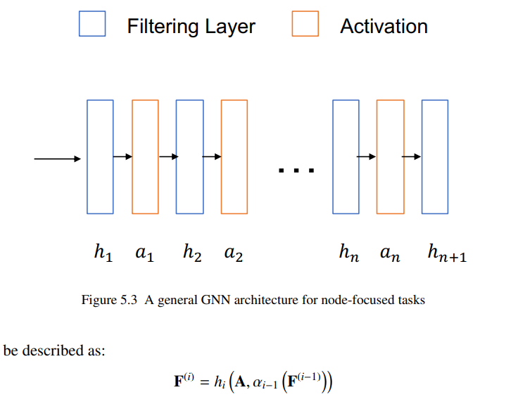
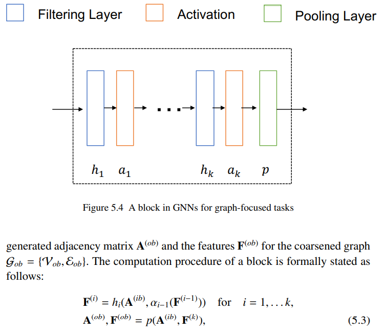
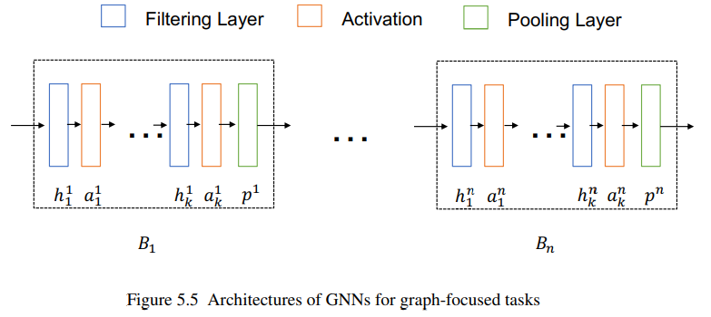
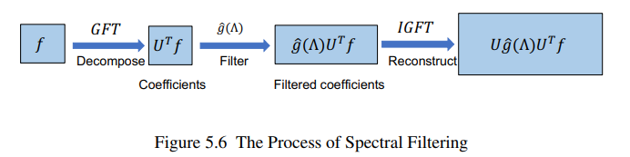
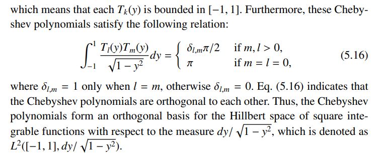
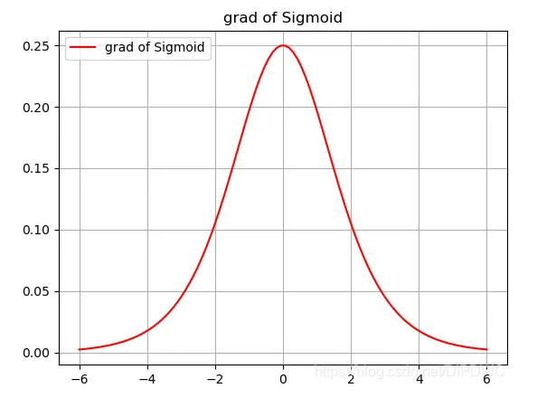
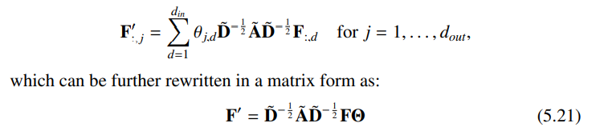
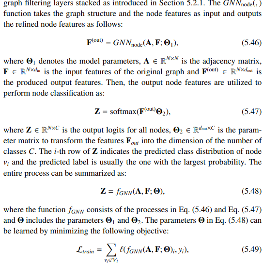
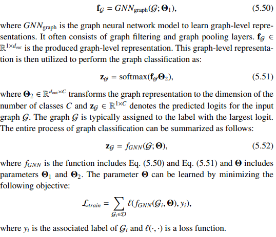

## Chapter5 Graph Neural Network
### 2022.03.21

GNN可以被看作是图层面的表示学习(representation learning)，对于node-focused task而言，GNN是为了在训练的过程中学习到对于图中结点的更好的表达(Embedding/representation)，而对于graph-focused task而言，GNN可以在训练的过程中更好的学习对于整张图的更好的特征与表达：
1. Node-focused task：在训练的过程中学习对结点更好的表达，learn node features
2. Graph-focused task：在训练的过程中学习对整张图更好的表达/特征，learn graph features

在学习结点特征的过程中，我们希望在学习结点特征的过程中能够同时考虑到结点的特征(node features)和图结构(graph structure)，数学化的表达可以是$\bold{F}^{(of)}=h(\bold{A},\bold{F}^{(if)})$，即仅改变图中结点的特征，而并不改变图中结点的连接（即邻接矩阵，图结构不变），这就是**graph filter**，通常对于node-classification任务而言，使用graph filter就足够了。但是对于graph focused task而言，一般需要进一步提取出整个图结构的特征，因此需要进一步使用**graph pooling**操作，从node features中进一步提取出graph-level feature。

对于**graph filtering**和**graph pooling**：
1. graph filtering: $\bold{F}^{(of)}=h(\bold{A},\bold{F}^{(if)})$，其中$\bold{F}^{(if)}, \bold{F}^{(of)}$分别是经过graph filtering前后输出各结点特征的特征矩阵$\bold{F}^{(if/of)}\in R^{N\times d_{if/of}}$即在经过graph filtering前后结点的特征维度可能会发生变化，但结点数，以及整体的图结构并不会发生变化。对node-focused task而言，graph filtering是足够的。
2. graph pooling: $\bold{A}^{(op)},\bold{F}^{(op)}=h(\bold{A}^{(ip)},\bold{F}^{(ip)})$，其中不仅改变了pooling前后的结点特征，还在网络训练的过程中改变了图结构，直观的改变就是图的邻接矩阵在pooling前后发生了变化，这样便于提取出整个图结构的特征(总结出整个图结构的特征)，对于graph focused task而言更加有效。

### 5.2 General GNN Framework
### 5.2.1 General Framework for Node-focused Tasks

对于Node-focused tasks来说，Graph Filter运算即是可以提取出有效的结点特征，因此仅需要在GNN中堆叠graph filtering层以及activation层。

### 5.2.2 General Framework for Graph-focused Tasks

而对于Graph-focused tasks来说，需要进一步使用Graph Pooling层来从图的结点中进一步提取graph level的特征。因此可以通过堆叠由graph filtering层与activation层交叉堆叠组成的block和pooling层来完成对graph-level features的提取。

### 5.3 Graph Filters

对于graph filter而言，一般有两种思路来设计graph filter：
1. spatial-based filters，空域图滤波器侧重于利用图结构中的信息（如结点之间的邻接信息）来提取更好的特征(feature refining)
2. spectral-based filters，频域图滤波器侧重于通过spectral graph theory来在图频域中提取图中的特征

### 5.3.1 Spectral-based Graph Filters

基于Graph Spectral Theory（即图的Laplacian矩阵，smoothness，图傅里叶变换等方法）来进一步提高图中结点特征的效果。

**Graph Spectral Filtering**：图频域滤波是指通过**调整图中某些频率，来实现去除某些频率分量而保留一部分的频率分量**。因此对于一个给定图结构，首先需要使用Graph Fourier Transform来获得他的图傅里叶参数(Graph Fourier Coefficients)，然后通过调整这些频率分量的权重来在空域中重构整张图(reconstruct the signal in the spatial domain)。

对于一个图中信号$f\in R^{N}$（即假设图中的信号对于每一个结点而言是一个常量scalar），其傅里叶变换参数被定义为$\hat{f}=U^Tf$，其中$U$为从给定图结构的Laplacian矩阵中所提取出来的eigenvector所组成的矩阵。$\hat{f}$中的第$i$个参数对应着图Laplacian矩阵的一个eigenvector，其对于的频率值即为对应的eigenvalue $\lambda_i$。故想要调整图中的各频率分量仅需要对傅里叶变换后的各频率参数进行调整，即$\hat{f}^{'}[i]=\hat{f}[i]\cdot \gamma(\lambda_i)$（**即对于频率为$\lambda_i$的频率分量$\hat{f}[i]$加上一个系数$\gamma(\lambda_i)$来调整一个给定图结构中所有的频率分量的大小**）。矩阵形式$\hat{f}^{'}=\gamma(\Lambda)\cdot \hat{f}=\gamma(\Lambda)\cdot U^Tf$，其中$\Lambda$为给定图拉普拉斯矩阵的特征值的对角矩阵。当调整完图中各频率分量的大小后，既可以使用逆傅里叶变换获得经过过滤后的图信号的值（对应到Node-focused GNN task中即是node features）$f^{'}=U\hat{f}^{'}=U\cdot \gamma(\Lambda)\cdot U^Tf$。由上式可以看作对输入信号/结点特征向量**加上了$U\cdot \gamma(\Lambda)\cdot U^T$操作符**，当$\gamma(\Lambda)$中对应某一频率分量的参数为0的时候，即代表需要在原图中删除该频率分量。整个Graph Filtering Processing可以看作：

其中的$U\cdot \gamma(\Lambda)\cdot U^T$可以看作是graph filtering operator。

若我们想要在原图中保留低频信息，则对于较大值的$\lambda_i$而言，相应的$\gamma(\lambda_i)$应该相应的为低值，例如$\gamma(\lambda_i)=\frac{1}{1+c\lambda_i}$此类的形式，通过使用这种滤波函数，原图中的平滑信息能够被保存下来，即原图中的信号会变得更加smooth。一般若是知道想要保存什么频率段的图信号就可以根据需求来设计$\gamma(\Lambda)$函数，但是一般对于GNN来说，并不知道想要保存什么频率段的信息，因此可以对$\gamma(\lambda_l)$建模，然后再通过learning的方式来学习模型的参数。例如设置$\gamma(\lambda_l)=\theta_l$。

但是使用该种方法来设置频域滤波的参数也会有很多问题，其中最重要的问题就是再图傅里叶变换中$\hat{f}=U^Tf$其频率分量的数量于图结构中的结点数目一致，因此对于滤波器而言，对图结构中的每一个频率分量都需要维护一个滤波系数，总数等于图结点的数目，因此模型需要维护一个$\gamma(\Lambda)\in R^{N\times N}$的矩阵，**当图结构过大的时候/即图中结点数量过多的时候，其内存开销会变得很大**，并且也会**需要大量的数据来拟合整个滤波矩阵**，同时$U\cdot \gamma(\Lambda)\cdot U^T$会是一个紧密矩阵(dense matrix)，因此带来的问题就是，输出信号$f^{'}$会与图中的多个结点有相连关系，因此该operator就不是localized（即图中一个信号的变化通常会引起多个输出结点的变化）。

总结：为每一个频率分量维护一个滤波系数，即$\gamma(\lambda_i)=\theta_i,\quad \gamma(\Lambda)=diag(\theta_1,\theta_2,...,\theta_N)$的缺点：
1. 当需要处理的图结构过大的时候，图中结点数过多，单独为每一个频率分量维护一个滤波系数相当于维护一个$N\times N$的对角矩阵，其开销太大。需要大量数据来拟合整个矩阵。
2. graph filtering operator $U\cdot \gamma(\Lambda)\cdot U^T$会是一个dense matrix，即输出信号中$f^{'}$可能与图中大部分结点都有关系，即图中一个信号的变化通常会引起多个输出结点的变化，该操作符并不是localized。

### Polynominal Filter Operator-2016-NIPS-Defferrard

Poly-Filter的提出在一定程度上缓解了解决以上的问题，在其中polynomial filter operator被建模为是一个K阶截断的多项式：$\gamma(\lambda_l)=\sum_{k=0}^K\theta_k\lambda_l^k$，该式的矩阵形式可以被写作$\gamma(\Lambda)=\sum_{k=0}^K\theta_k\Lambda^k$，其中可以看到原矩阵的参数被简化到了仅有$K+1$项。同时通过化简可以将graph filtering operator $U\cdot \gamma(\Lambda)\cdot U^T$化简到原图拉普拉斯矩阵的多项式，故优点为：
1. 原矩阵参数仅有$K+1$项，不与原图中的结点数相关，即是scalable的方法。
2. 原graph filtering operator $U\cdot \gamma(\Lambda)\cdot U^T$可以被原图拉普拉斯矩阵的多项式形式，故**不需要对原图的拉普拉斯矩阵做特征值分解(eigendecomposition)**。且**多项式的graph filtering operator是localized**，即输出信号的某一项仅与图中的某一些结点相关。

即$U\cdot\Lambda^k\cdot U^T=L^k$，即原式有$f^{'}=\sum_{k=0}^K\theta_kU\cdot\Lambda^k\cdot U^Tf=\sum_{k=0}^K\theta_kL^kf$，且原图的拉普拉斯矩阵是稀疏的，因为经过证明可以有**矩阵$L^k$的第$(i,j)$个元素当且仅当两结点$v_i,v_j$之间的最短路径小于或等于$k$的时候不为0**。即$L^k(i,j)\neq0, iff\quad dis(v_i,v_j)\leq k$。故该方法时localized，即对于滤波后的向量的某一值来说，仅与结点周围的一定量的结点值有关，而不是与图中所有结点都相关。

Poly-Filter也可以看成是一个空域滤波器(spatial filter)，因为原式可以被转换成$f^{'}[i]=b_{i,i}f[i]+\sum_{v_j\in \mathcal{N}^K(v_i)}b_{i,j}f[j],b_{i,j}=\sum^K_{k=dis(v_i,v_j)}\theta_kL^k_{i,j}$，即是在空域的角度来对原图结点的特征进行滤波。

**不足**：Poly-Filter仍有不足，即他的多项式的基相互之间并不是正交的，这会导致各多项式系数之间并不是相互独立的，即多项式系数之间会相互影响，这会导致在训练的过程中这些系数不稳定。于是我们希望能够找到一种滤波器其系数彼此之间是相互独立的。

### Chebyshev Polynomial and Cheby-Filter

Chebyshev多项式系数可以通过递推得到$T_k(y)=2yT_{k-1}(y)-T_{k-2}(y)$，其中$T_0(y)=1,T_1(y)=y$，其中$y\in[-1,1]$。并且切比雪夫系数可以通过$T_k(y)=\cos(k\arccos(y))$得到。切比雪夫系数之间彼此在Hilbert空间正交：

故为了满足切比雪夫多项式系数的输入值范围要求，需要对给定图拉普拉斯矩阵的特征值做缩放$\tilde{\lambda}_l=\frac{2\cdot\lambda_l}{\lambda_{max}}-1,\tilde{\Lambda}=\frac{2\cdot\Lambda}{\lambda_{max}}-I$，故Chebyshev Filter系数可以写成$\gamma(\Lambda)=\sum_{k=0}^K \theta_kT_k(\tilde{\Lambda})$，故整个滤波后的系数可以写成$f^{'}=\sum_{k=0}^K\theta_kUT_k(\tilde{\Lambda})U^Tf$，**若使用该式计算则仍需要对原拉普拉斯矩阵做eigendescomposition**，故进一步简化后可以得到$f^{'}=\sum_{k=0}^K\theta_kT_k(\tilde{L})f$。

### GCN-Filter仅涉及原结点周围距离为1的结点(1-hop nodes)

GCN Filter是Chebyshev Filter在K=1的特殊形式，如此一来对于滤波输出的node features，对于一个结点仅会涉及 1-hop neighbors。

故有:

$\gamma(\Lambda)=\theta_0T_0(\tilde{\Lambda})+\theta_1T_1(\tilde{\Lambda})\\\quad\quad=\theta_0I+\theta_1\tilde{\Lambda}\\\quad\quad=\theta_0I+\theta_1(\Lambda-I)$

将GCN-Filter运用到输入结点信号中有：

$f^{'}=\theta_0f-\theta_1(D^{-1/2}AD^{-1/2})f$，为了进一步简化即可以令$\theta_1=-\theta_0$，故有$f^{'}=\theta_0(I+D^{-1/2}AD^{-1/2})f$，而由于$I+D^{-1/2}AD^{-1/2}$特征值在$[0,2]$范围内，若重复将该运算符作用在learning中，可能会导致numerical instability/vanishing or exploring gradients，故为了消除影响将该运算符归一化$\tilde{A}=A+I$，$\tilde{D}_{ii}=\sum_j\tilde{A}_{i,j}$，最终归一化的运算符为$\tilde{D}^{-1/2}\tilde{A}\tilde{D}^{-1/2}$。GCN-Filter同样也可以被看作是空域滤波器，因为其仅与与目标结点有边直接相连的结点有关。

**Vanishing/Exploding Gradients与Eigenvalue之间的关系**：

Vanishing/Exploding Gradients是对于激活函数为Sigmoid函数$sigmoid(x)=\frac{1}{1+e^{-z}}$所提出的问题，即当对目标是用来sigmoid函数，当其值过大或是过小的时候，整个函数的导数值过小，导致其更新的速度变得非常缓慢，最终导致可能是神经网络后续层几乎不更新参数值，sigmoid函数导数函数如图所示：

受该现象影响最显著的即是普通的RNN网络(vanilla rnn)，因为在该种网络中每个time stamp的参数在整个网络中是共同使用的，即$h^{(t)}=Wh^{(t-1)}$，对参数矩阵$W$做eigendecomposition有$h^{(t)}=Q\Lambda Q^Th^{(0)}$，从该式中可以看出，当对多个时间戳后的RNN网络状态进行求解的时候，重复将相同的参数矩阵作用在每个时间戳对应的状态向量时，相当于最终将$h^{(0)}$向着有着最大特征值的特征向量的方向上做投影，因此当$\lambda>1$时，会引起Exploding Gradients，而小于1时会导致Vanishing Gradients。

解决方法即是更换激励函数，或是改变整体结构。而CNN由于每一层的参数并不是相同的，故受该种现象的影响没有Vanilla RNN大。因此，重复作用特征值范围在[0,2]的操作符在输入图信号中，便会导致该现象的发生，造成numerical instability。

### GCN Filter for multi-channel signal

对于多通道的数据而言有：$F^{'}=\tilde{D}^{-1/2}\tilde{A}\tilde{D}^{-1/2}F\Theta$，其中$\Theta\in R^{d_{in}\times d_{out}}$，即$d_{out}$是总共使用的滤波器的数量，而$d_{in}$是输入通道数。

若仅使用一个滤波器，其参数$\Theta\in R^{1\times d_{in}}$，即所需要学习的参数是一个向量。

### 5.3.2 Spatial-based Graph Filters

频域滤波器中的GCN其实也可以看作是空域滤波器，因为其仅仅涉及了某结点周围距离为1的结点的信息(1-hop neighbors)。最初运用在GNN中的滤波器也是空域滤波器：$F_i^{'}=\sum_{v_j\in \mathcal{N}(v_i)}g(l_i,F_j,l_j)$，即就是考虑到了与给定结点相邻接的结点的信息，其中$g(\cdot)$即为转换函数。

### GraphSAGE-Filter

该空域滤波器也是从与某结点邻接的结点中进行采样，得到新特征以及新节点，具体步骤包括了：
1. 从给定结点$v_i$的邻接结点$\mathcal{N}(v_i)$中采样S个结点,$\mathcal{N}_S(v_i)=SAMPLE(\mathcal{N}(v_i),S)$。
2. 从采样的结点中结合/聚集/提取出特定特征，$f^{'}_{\mathcal{N}_s(v_i)}=AGGREGATE({F_j,\forall v_j\in\mathcal{N}_s(v_i)})$，其中AGGREGATE函数可以选择简单提取均值，或是使用LSTM等方法处理。
3. 合并原结点特征越提取出来的特征，$F^{'}_i=\sigma([F_i,f^{'}_{\mathcal{N}_S(v_i)}]\Theta)$

### GAT-Filter

即将attention机制融合进了空域滤波中，为结点周围的每个结点的特征分配一个重要系数最终建模：

$e_{i,j}=a(F_i\Theta,F_j\Theta)$，随后再用softmax函数对$e_{i,j}$做归一化，最终得到$F^{'}_i=\sum_{v_j\in\mathcal{N}(v_i)\cup\{v_i\}}\alpha_{ij}F_j\Theta$

### ECC-Filter

该Filter考虑了不同的结点之间的边类型可能不同，故为不同的结点类型分配了不同的参数，即：$F^{'}_i=\frac{1}{|\mathcal{N}(v_i)|}\sum_{v_j\in \mathcal{N}(v_j)}F_j\Theta_{tp(v_i,v_j)}$，$tp(v_i,v_j)$即为结点之间的类型，不同的类型的参数不同。

### GGNN-Filter

将GRU融入进了更新步骤，其实也是自适应调整不同结点特征之间的重要性比例。

### 5.4 Graph Pooling

总体而言有两种方式：
1. Flat Graph Pooling：即没有多层结构，整张图的结构与信息映射到一个结点，故该种pooling方法其实不涉及到图结构上的改变，而是整张图到一个结点，仅有特征上面的summary。特征summary的方法可以是最值，均值或是attention平均等。**由于flat graph pooling最终是集合到一个点，故可以在原图中加上一个fake node，用于在整个训练过程中加入，该fake node与图中所有结点相连**
2. Hierarchical Graph Pooling：层次式pooling即分层次来降维图结构，减少图结构中的结点，不像flat形式一次性summarize到一个结点，而是每一层summarize到不同的图结构。该方法也分为两种子方法：
   1. Downsampling-based Pooling：即通过在原图中选择最重要的N个结点来coarsen原输入图结构，可以通过计算原图中结点的importance score并将其排序，取最重要的N个结点进行来作为下一层的图结构，被选中的结点之间的相互连接关系即被保留
   2. Supernode-based Pooling：与Downsampling方法不同超结点方法将原图中的多个节点综合成一个超结点(supernode)，supernode的特征更具选择的方法保留。

### 5.5 Parameter Learning for GNN

### Node Classification

### Graph Classification

